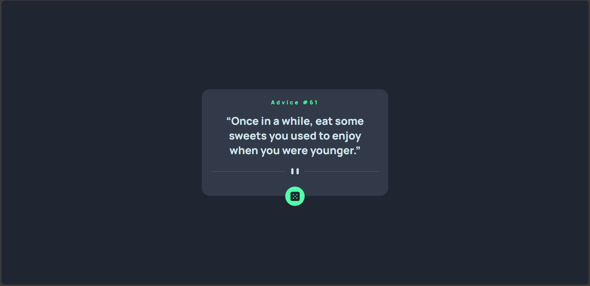

# Frontend Mentor - Advice generator app solution

This is a solution to the [Advice generator app challenge on Frontend Mentor](https://www.frontendmentor.io/challenges/advice-generator-app-QdUG-13db). Frontend Mentor challenges help you improve your coding skills by building realistic projects.

## Table of contents

- [Overview](#overview)
  - [The challenge](#the-challenge)
  - [Screenshot](#screenshot)
  - [Links](#links)
- [My process](#my-process)
  - [Built with](#built-with)
  - [What I learned](#what-i-learned)
  - [Continued development](#continued-development)
  - [Useful resources](#useful-resources)
- [Author](#author)

## Overview

### The challenge

Users should be able to:

- View the optimal layout for the app depending on their device's screen size
- See hover states for all interactive elements on the page
- Generate a new piece of advice by clicking the dice icon

### Screenshot



### Links

- Solution URL: https://github.com/LeviKuhaulua/Front-End-Mentor/tree/main/advice-generator-app
- Live Site URL: https://levikuhaulua.github.io/Front-End-Mentor/advice-generator-app/advice.html

## My process

### Built with

- Semantic HTML Elements
- Accessibility Attributes (hopefully I'm using it correctly)
- JavaScript 

### What I learned

This project helped me with retrieving JSON data and then using that data to manipulate the text content of an element. Particularly, I liked using the `await/async` syntax(?) for grabbing data from the API. See code below: 

```js
async function getAdvice() {
  const adviceIdElm = document.getElementById('adviceSlipId'); 
  const adviceTextElm = document.getElementById('adviceSlip'); 

  let adviceSlip = await fetch('https://api.adviceslip.com/advice');
  let adviceData = await adviceSlip.json(); 

  adviceIdElm.textContent = `Advice #${adviceData.slip.id}`; 
  adviceTextElm.textContent = adviceData.slip.advice; 
  
}
```

Additionally, this project also taught me a little about using ARIA attributes in my html file. Particularly adding this line `aria-live="assertive"` will help with announcing changes made to the page as soon as they happen. I felt like this was important since if the user click on the button, then they should be notified immediately that the advice had been changed. Another thing that I did was in the same function add some logic using the `ariaBusy` attribute so that the screen readers announce the change once it has been made. 

```js
do {
  adviceIdElm.ariaBusy = "true"; 
} while(adviceIdElm.textContent.length === 0); // Content hasn't finished loading. 

adviceIdElm.ariaBusy = "false"; 

// ... Did the same thing with the advice itself. 
```

### Continued development

I want to get better with using ARIA attributes in my HTML file especially for live regions as that would be important for dynamically changing content. Another thing that I want to develop is getting better with working with JSON formatting for data and using APIs in my JavaScript. For future projects, I will try to use ARIA attributes if applicable then test them using a screen reader. 

### Useful resources

- [MDN Web Docs](https://developer.mozilla.org/en-US/docs/Web) - The resources used here were the CSS and JavaScript documentation. Another section that helped was their section on Accessibility. 

## Author

- Frontend Mentor - [@LeviKuhaulua](https://www.frontendmentor.io/profile/LeviKuhaulua)
- Github - [LeviKuhaulua](https://github.com/LeviKuhaulua)
- LinkedIn - [Levi Kuhaulua](www.linkedin.com/in/levi-kuhaulua)
