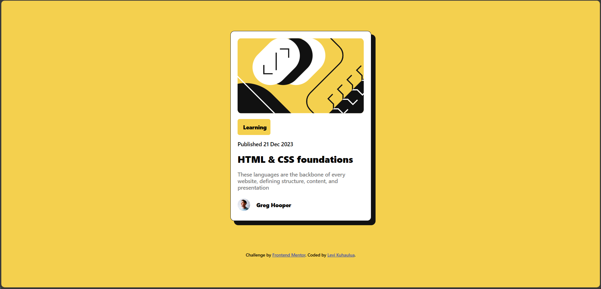
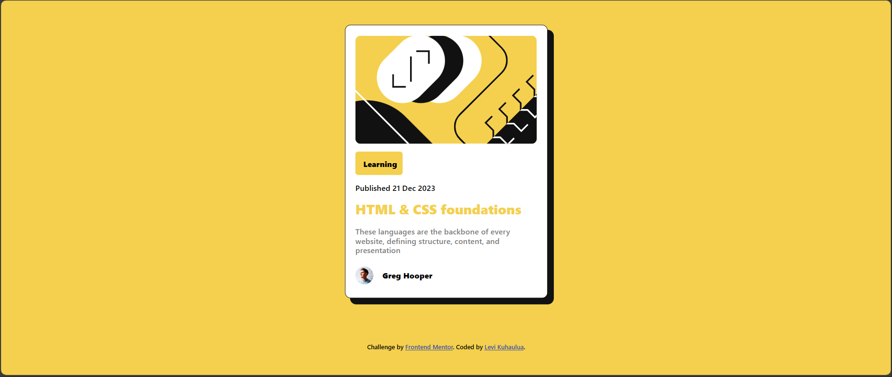
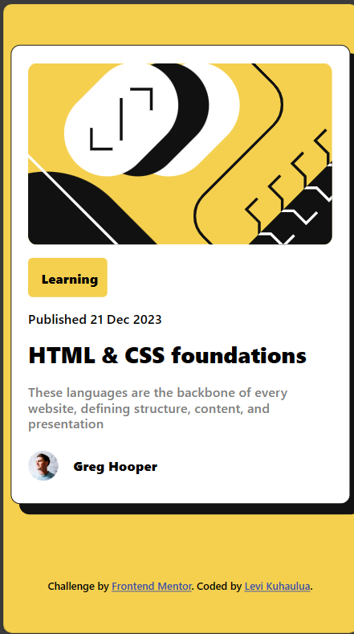

# Frontend Mentor - Blog preview card solution

This is a solution to the [Blog preview card challenge on Frontend Mentor](https://www.frontendmentor.io/challenges/blog-preview-card-ckPaj01IcS). Frontend Mentor challenges help you improve your coding skills by building realistic projects. 

## Table of contents

- [Overview](#overview)
  - [The challenge](#the-challenge)
  - [Screenshot](#screenshot)
  - [Links](#links)
- [My process](#my-process)
  - [Built with](#built-with)
  - [What I learned](#what-i-learned)
  - [Continued development](#continued-development)
  - [Useful resources](#useful-resources)
- [Author](#author)
- [Acknowledgments](#acknowledgments)


## Overview

### The challenge

Users should be able to:

- See hover and focus states for all interactive elements on the page

### Screenshot



<br/> 



<br/> 



### Links

- Solution URL: [https://github.com/LeviKuhaulua/Front-End-Mentor/blog-preview-card]()
- Live Site URL: [https://levikuhaulua.github.io/Front-End-Mentor/blog-preview-card/preview%20card.html]()

## My process

### Built with

- Semantic HTML Elements 
- BEM Naming Conventions
- Flex
- CSS Custom Properties 
- CSS Selectors and Pseudo-Classes

### What I learned

I learned a new way to import and use Google Fonts using the `@import` in my CSS file. See below for how I did it: 

```css
@import url(https://fonts.googleapis.com/css2?family=Figtree:wght@500;800&display=swap); 

.figtree-500 {
  font-family: "Figtree", 'Segoe UI', Roboto, system-ui, sans-serif; 
  font-optical-sizing: auto; 
  font-weight: 500; 
  font-style: normal; 
}

.figtree-800 {
  ... same thing just replace font-weight with 800
}
```

Another thing that I'm proud of is the Flex styling that I used to center the content to the middle of the screen: 

```css
body {
  ...
  min-height: 100vh; /* Needed so that body's height is the height of the viewport */ 
  display: flex; 
  flex-direction: column; 
  justify-content: center; 
  align-items: center; 
  flex-wrap: wrap; 
}
```

The above code came from somebodys comment to my QR Code Solution. See in [Acknowledgement](#acknowledgments)

### Continued development

What I want to continue developing is some of the best practices for HTML and CSS when it comes to naming conventions. I believe following it will help make my code much more readable and understandable. Another thing that I want to continue working on is the CSS resources such as Flex / Grid to help me with making responsive layouts and to help me understand the basic HTML, CSS, JavaScript syntax to help prepare me for using frameworks. 

### Useful resources

- [CSS Naming Conventions](https://www.frontendmentor.io/articles/understanding-css-naming-conventions-bem-oocss-smacss-and-suit-css-V6ZZUYs1xz) - which helped to describe the different naming conventions found in your HTML and Style sheet with examples to show how you can implement each naming convention to your code. 

## Author

- Frontend Mentor - [@LeviKuhaulua](https://www.frontendmentor.io/profile/LeviKuhaulua)
- Github - [LeviKuhaulua](https://github.com/LeviKuhaulua)
- LinkedIn - [Levi Kuhaulua](www.linkedin.com/in/levi-kuhaulua)


## Acknowledgments

I want to thank both [@kodan96](https://www.frontendmentor.io/profile/kodan96) and [@bmuia](https://www.frontendmentor.io/profile/bmuia) for explaining how to use CSS Flex to center content to the middle of the page. Specifically this quote by @kodan96 as to the *why* this works: 

> You can center your content with *Flexbox* but you have to specify height for the `body` tag. Without that flexbox won't center your content. 

