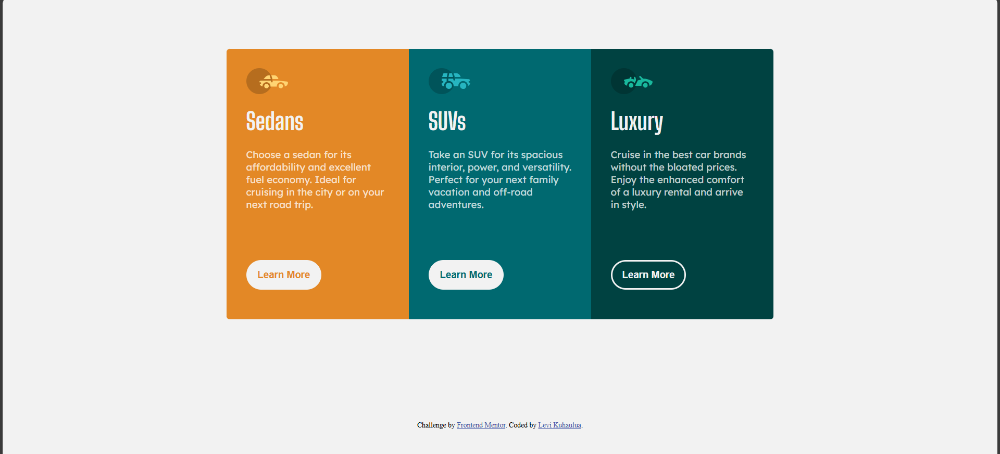

# Frontend Mentor - 3-column preview card component solution

This is a solution to the [3-column preview card component challenge on Frontend Mentor](https://www.frontendmentor.io/challenges/3column-preview-card-component-pH92eAR2-). Frontend Mentor challenges help you improve your coding skills by building realistic projects. 

## Table of contents

- [Overview](#overview)
  - [The challenge](#the-challenge)
  - [Screenshot](#screenshot)
  - [Links](#links)
- [My process](#my-process)
  - [Built with](#built-with)
  - [What I learned](#what-i-learned)
  - [Continued development](#continued-development)
  - [Useful resources](#useful-resources)
- [Author](#author)
- [Acknowledgments](#acknowledgments)


## Overview

### The challenge

Users should be able to:

- View the optimal layout depending on their device's screen size
- See hover states for interactive elements

### Screenshot




### Links

- Solution URL: https://levikuhaulua.github.io/Front-End-Mentor/card-columns/card-columns.html
- Live Site URL: https://github.com/LeviKuhaulua/Front-End-Mentor/tree/main/card-columns

## My process

### Built with

- Semantic HTML Elements 
- CSS Nesting
- CSS Grid 
- CSS Sub-Grid 
- CSS Selectors

### What I learned

I learned a lot about CSS Grid and Subgrid, this challenge helped me get comfortable with using Grid and Subgrid to style components. Especially for components where you want the elements for each component to be lined up with each other despite size differences. 

The CSS Grid and Subgrid can be found below with notes from me on why this works: 

```css
.columns {
  display: grid; 

  /* auto-fit is used to help with responsiveness */
  grid-template-columns: repeat(auto-fit, minmax(240px, 1fr)) 

}

.columns__card {
  display: grid; 

  /* No need to define because browser / device will determine amount of rows needed */
  grid-template-rows: subgrid; 

  /* This is the last important piece to ensure that the card components will wrap at smaller screen sizes */
  grid-row: span 4; 
}
```

### Continued development

I want to continue to get better with CSS functions, selectors, naming conventions, and also layout tools like Flex and Grid + Subgrid so that I can write more robust and scalable code for webpages. 

### Useful resources

- [CSS Subgrid - Slaying the Dragon](https://www.youtube.com/watch?v=Yl8hg2FG20Q) - excellent resource and youtuber that went over the use-case / implementation of CSS Subgrids and common pitfalls that you may encounter. 

## Author

- Frontend Mentor - [@LeviKuhaulua](https://www.frontendmentor.io/profile/LeviKuhaulua)
- Github - [LeviKuhaulua](https://github.com/LeviKuhaulua)
- LinkedIn - [Levi Kuhaulua](www.linkedin.com/in/levi-kuhaulua)

## Acknowledgments

The video found in the [Resources](#useful-resources) section helped me with setting up `Subgrid` and how to avoid common pitfalls when trying to set up the responsiveness of CSS Grid + Subgrid layouts. 
