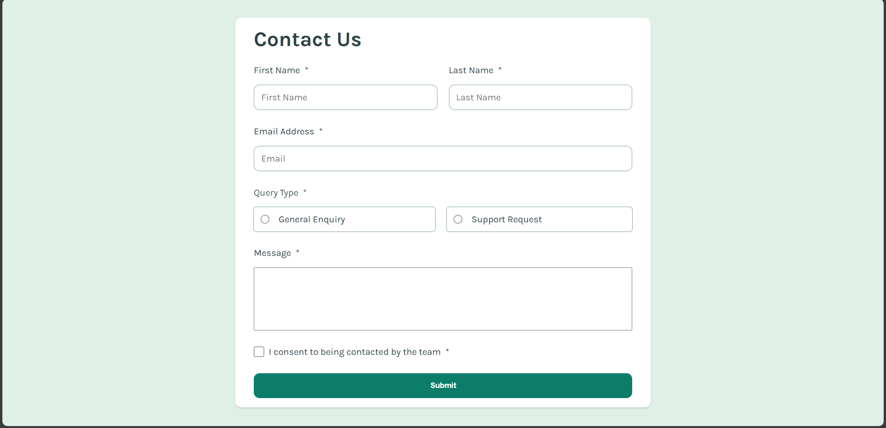

# Frontend Mentor - Contact form solution

This is a solution to the [Contact form challenge on Frontend Mentor](https://www.frontendmentor.io/challenges/contact-form--G-hYlqKJj). Frontend Mentor challenges help you improve your coding skills by building realistic projects. 

## Table of contents

- [Overview](#overview)
  - [The challenge](#the-challenge)
  - [Screenshot](#screenshot)
  - [Links](#links)
- [My process](#my-process)
  - [Built with](#built-with)
  - [What I learned](#what-i-learned)
  - [Continued development](#continued-development)
  - [Useful resources](#useful-resources)
- [Author](#author)
- [Acknowledgments](#acknowledgments)


## Overview

### The challenge

Users should be able to:

- Complete the form and see a success toast message upon successful submission
- Receive form validation messages if:
  - A required field has been missed
  - The email address is not formatted correctly
- Complete the form only using their keyboard
- Have inputs, error messages, and the success message announced on their screen reader
- View the optimal layout for the interface depending on their device's screen size
- See hover and focus states for all interactive elements on the page

### Screenshot



### Links

- Solution URL: https://github.com/LeviKuhaulua/Front-End-Mentor/tree/main/contact-form
- Live Site URL: https://levikuhaulua.github.io/Front-End-Mentor/contact-form/contact-form.html
## My process

### Built with

- Semantic HTML Elements
- ARIA Attributes
- CSS Flex
- JavaScript 

### What I learned

Something that I used to style the components of the checkbox and radio buttons specifically without using the images found in the assets folder was to use the `accent-color` attribute and also specify a width and height. See code below: 

```css
.form__input-checkbox {
  display: block; 
  width: 18px; 
  height: 18px; 
  accent-color: var(--clr-green); 
}
```

It's important to set a width and height or the element will not resize. For the `accent-color` attribute, this styles the input with the specified color - with checkmarks, this is a green background with a white checkmark, and for radio buttons, this is a green background color. Another thing that is nice, is that the browser will determine the complementary color to match the accent-color given (if that makes sense). 

Additionally, in JavaScript, I thought this was a neat logic trick to handle the error states. 

```js
const anyInvalids = document.querySelector('*[aria-invalid="true"]'); 
if (anyInvalids === null) {
  // Applied success state if no invalids were found
}
```

Essentially, what this is saying is return the first element (any element) that has an aria-invalid attribute of true. If there is one, then we know that the form is invalid, otherwise, we know that the user filled out all required aspects of the form. 

### Continued development

Definitely using ARIA properties, attributes, and states. This was a challenge as I haven't really used ARIA in-depth in other challenges. When I try other challenges, I will make sure to practice using ARIA elements and then test it out using a screen reader. 

### Useful resources

- [MDN WAI-ARIA](https://developer.mozilla.org/en-US/docs/Web/Accessibility/ARIA) - This article helped to provide information on how to make your elements accessible to those with disabilities and use cases of when you should implement ARIA attributes or elements. 
- [WAI ARIA](https://www.w3.org/TR/wai-aria-1.1/#roles) - These specifications go super in-depth on when and how to use ARIA related attributes, properties, and states.
- [A11ycasts with Rob Dodson](https://youtube.com/playlist?list=PLNYkxOF6rcICWx0C9LVWWVqvHlYJyqw7g&si=f5Kkh1fsBLoZZgnm) - this playlist is super insightful on how to incorporate accessibility into your webpages. 

## Author

- Frontend Mentor - [@LeviKuhaulua](https://www.frontendmentor.io/profile/LeviKuhaulua)
- Github - [LeviKuhaulua](https://github.com/LeviKuhaulua)
- LinkedIn - [Levi Kuhaulua](www.linkedin.com/in/levi-kuhaulua)

## Acknowledgments

[MDN aria-errormessage attribute](https://developer.mozilla.org/en-US/docs/Web/Accessibility/ARIA/Attributes/aria-errormessage) - the code found in this documentation regarding how we can use CSS to style elements that were manipulated in JavaScript. What I mean by this is the attribute selector in CSS. 

```css
some-element[attribute="value"] {
  ... styles
}
```

Which gave me the inspiration to use it in my code to handle the logic with the error states. 

