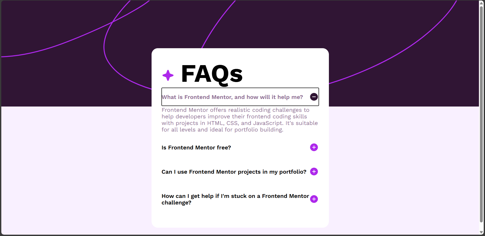

# Frontend Mentor - FAQ accordion solution

This is a solution to the [FAQ accordion challenge on Frontend Mentor](https://www.frontendmentor.io/challenges/faq-accordion-wyfFdeBwBz). Frontend Mentor challenges help you improve your coding skills by building realistic projects. 

## Table of contents

- [Overview](#overview)
  - [The challenge](#the-challenge)
  - [Screenshot](#screenshot)
  - [Links](#links)
- [My process](#my-process)
  - [Built with](#built-with)
  - [What I learned](#what-i-learned)
  - [Continued development](#continued-development)
  - [Useful resources](#useful-resources)
- [Author](#author)
- [Acknowledgments](#acknowledgments)


## Overview

### The challenge

Users should be able to:

- Hide/Show the answer to a question when the question is clicked
- Navigate the questions and hide/show answers using keyboard navigation alone
- View the optimal layout for the interface depending on their device's screen size
- See hover and focus states for all interactive elements on the page

### Screenshot



### Links

- Solution URL: https://github.com/LeviKuhaulua/Front-End-Mentor/tree/main/faq-accordion
- Live Site URL: https://levikuhaulua.github.io/Front-End-Mentor/faq-accordion/faq-accordion.html

## My process

### Built with

- Semantic HTML Elements
- CSS Flex 
- CSS Custom Properties
- Media Queries 
- JavaScript

### What I learned

This project helped me understand and get comfortable with using JavaScript for Front-End Development. In this project, I learned how to add Event Listeners to the FAQ Section to help provide interactivity with the clients when they want to get the answer to a question. I'm proud of the code because it uses a function to update the FAQ Section. See the code below: 

```javascript
  function updateFAQ(questionElement) {
    const img = questionElement.querySelector("img")
    const faqAnswer = document.getElementById("faqAns" + questionElement.id.slice(7,))

    // Expand or Minimize section based on state of img element
    if (img.src.endsWith("/path/to/svg-plus icon")) {
      img.src = "/path/to/svg-minus icon"
      img.alt = "Minimize Icon" 
      faqAnswer.style.maxHeight = "1000px" // Help with the transition
      faqAnswer.ariaHidden = "false" 
    } else {
      img.src = "/path/to/svg-plus icon"
      img.alt = "Expand Icon"
      faqAnswer.style.maxHeight = "0" // 
      faqAnswer.ariaHidden = "true" 
    }
  }

  faqQstnOne.addEventListener("click", () => updateFAQ(faqQstnOne))
  ... do the same thing for the other faq sections
```

I also learned how to use the `script` tag in the HTML file for loading external scripts. In there I learned that when I put the script in the `head` tag, I should be using the `defer` attribute so that the script waits for all the elements to load before executing / running the script. Example: 

```html
<head>
  ... code here 

  <script src="link/to/js-file" defer></script> 
</head> 
<body> 
  ... elements and page layout here
</body> 
```

One last thing that I learned was CSS nesting which is where inside the style of an element you can use the & symbol followed by a class, element or state (or by itself) to style elements found inside. See my code below: 

```css
.faq__button {
  border: none; 
  background-color: unset; 
  text-align: inherit; 
  ... rest of style 

  &:focus-visible {
    color: var(--clr-purple; 
  }
}
```

This helps to make my styles more organized and meaningful by showing explicitly what style should apply to elements, classes, or states that are found within the parent element. 

### Continued development

I want to continue getting used to using JavaScript for Client-Side code and to add interactivity to my webpages. JavaScript is important as that will provide me with some useful functions such as data validation, sending information to a server, or helping out with transitions. I also want to get used to using CSS selectors (in the right scenarios) and the CSS nesting to get better at organizing my styles. 

### Useful resources

- [CSS Nesting - Kevin Powell](https://www.youtube.com/watch?v=YnWPeA6l5UE) - video that explains what is CSS nesting and how to use it. 
- [MDN Docs - JavaScript](https://developer.mozilla.org/en-US/docs/Web/JavaScript) - documentation for JavaScript. 


## Author

- Frontend Mentor - [@LeviKuhaulua](https://www.frontendmentor.io/profile/LeviKuhaulua)
- Github - [LeviKuhaulua](https://github.com/LeviKuhaulua)
- LinkedIn - [Levi Kuhaulua](www.linkedin.com/in/levi-kuhaulua)


## Acknowledgments

One of the challenges that occurred for the FAQ section was actually getting the answer section to expand smoothly. At first I tried to transition the height but noticed that it still didn't work. The article, [Using CSS Transition on the Height Property](https://dev.to/sarah_chima/using-css-transitions-on-the-height-property-al0) helped to define the different ways to transition the height property. The method that helped me was to set the `max-height` property then transition that instead of the regular `height` property.  
