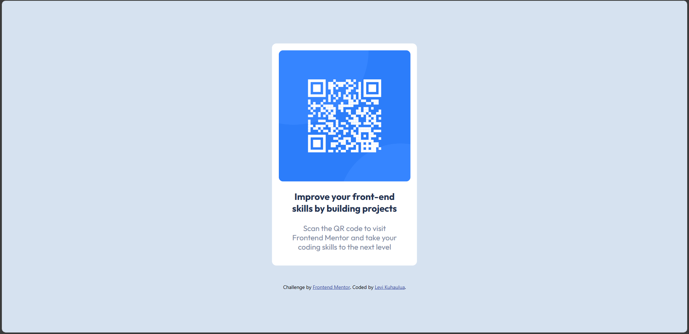
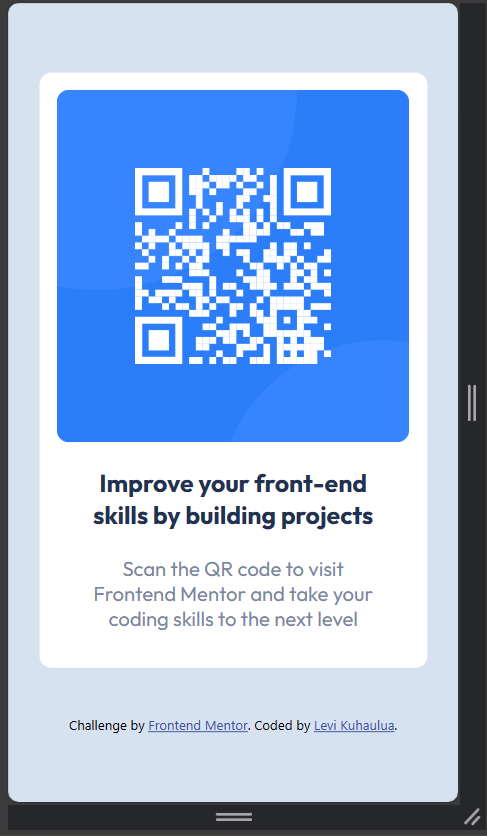

# Frontend Mentor - QR code component solution

This is a solution to the [QR code component challenge on Frontend Mentor](https://www.frontendmentor.io/challenges/qr-code-component-iux_sIO_H). Frontend Mentor challenges help you improve your coding skills by building realistic projects. 

## Table of contents

- [Overview](#overview)
  - [Screenshot](#screenshot)
  - [Links](#links)
- [My process](#my-process)
  - [Built with](#built-with)
  - [What I learned](#what-i-learned)
  - [Continued development](#continued-development)
  - [Useful resources](#useful-resources)
- [Author](#author)

## Overview

### Screenshot



<br/> 



### Links

- Solution URL: [Add solution URL here](https://your-solution-url.com)
- Live Site URL: [Add live site URL here](https://your-live-site-url.com)

## My process

### Built with

- Desktop-First Approach
- Semantic HTML Elements
- CSS custom properties
- CSS classes
- CSS selectors


### What I learned

When it comes to responsive images, that can be a challenge as we want it to preserve the same high quality for different types of devices. My solution to come to that was to do the following in the CSS style sheet: 

```css
img {
  display: block; 
  width: 100%; /* Make the image width responsive based on the parent container */ 
  border-radius: 10px; /* To round the image corners as shown in the Desktop and Mobile preview */ 
}
```

Then in my card component, I used the `ch` unit to help make the image width relative to the width of it's container.  

```css 
  .card {
    padding: 1em; /* Add some "fluff" to the card */ 
    width: 40ch; 
    /* Rest of Code */
  }
```

<br/><br/>

Another thing that I was having difficulties with was importing the Font Family `Outfit` from Google. I did have some experience with working with custom fonts before by downloading them then using the `@font-face` to import them. However, I wanted to find out how to use them without the need to download them. What I found when doing the `Get Font` > `Embed Code` of the [Outfit](https://fonts.google.com/specimen/Outfit) was to do the following in HTML and CSS:

```html
<head>
  <link rel="preconnect" href="https://fonts.googleapis.com"/>
  <link rel="preconnect" href="https://fonts.gstatic.com" crossorigin/>
  <link href="https://fonts.googleapis.com/css2?family=Outfit:[PUT OPTIONS HERE]" rel="stylesheet"/>
</head> 
```
```css
.Outfit-[SPECIFIER] {
  font-family: "Outfit", ...; 
  font-optical-sizing: auto; 
  font-weight: [USE WEIGHT AS SPECIFIED BY LINK TAG];  
  font-style: normal; 
}
```

For more information, please see the resource section. 

### Continued development

As I get continue developing my knowledge in HTML, CSS, and JavaScript (although not really needed here), I do plan to continue working on getting better with using CSS selectors which would be beneficial for later challenges and/or projects. Another thing that I do want to get better with and refine is creating responsive layouts and elements to help me make visually appealing websites for all kinds of devices. This continued development can be achieved through the course that I'm taking (see [Useful Resources](#useful-resources)), personal projects (both individual and group setting), and challenges found in Front-End Mentor. 


### Useful resources

- [Google Fonts API Resource](https://developers.google.com/fonts/docs/css2) - This resource helped me understand how to import web fonts from Google using the `<link>` element.  
- [MDN Web Docs - HTML Elements](https://developer.mozilla.org/en-US/docs/Web/HTML/Reference) - The Mozilla Web Documentation is a super useful resource for HTML, CSS, and JavaScript (in my case, HTML Semantic Elements) which includes topics like use cases, and implementation notes. 
- [Kevin Powell - Conquering Responsive Layouts](https://courses.kevinpowell.co/conquering-responsive-layouts) - As an aspiring front-end developer, I like this FREE course by Kevin Powell because it helps me to better understand how to create visually appealing webpages for all kinds of devices. Helping you get comfortable with some of the tools that developers use to help make your webpage responsive. The greatest eye-opener from Kevin was that by design, websites are already responsive (basic HTML) - when we style them with CSS, it can actually get rid of the responsiveness to them. Because of that, it helped me to *really* think about the CSS that I'm writing and try to understand how it manipulates the HTML element. 


## Author

- Frontend Mentor - [@LeviKuhaulua](https://www.frontendmentor.io/profile/LeviKuhaulua)
- Github - [LeviKuhaulua](https://github.com/LeviKuhaulua)
- LinkedIn - [Levi Kuhaulua](www.linkedin.com/in/levi-kuhaulua)


