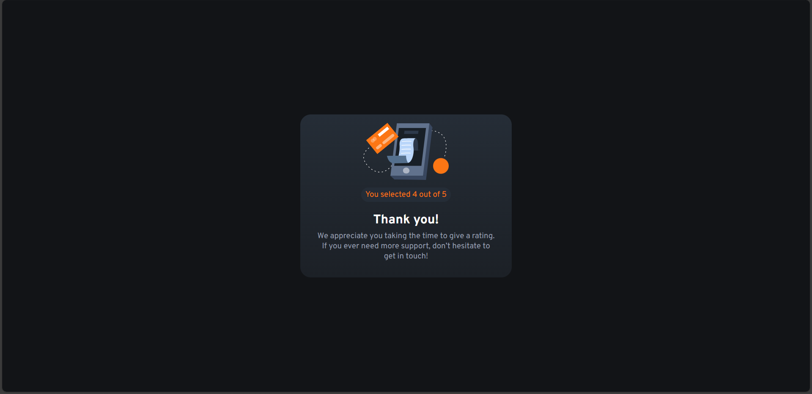

# Frontend Mentor - Interactive rating component solution

This is a solution to the [Interactive rating component challenge on Frontend Mentor](https://www.frontendmentor.io/challenges/interactive-rating-component-koxpeBUmI). Frontend Mentor challenges help you improve your coding skills by building realistic projects. 

## Table of contents

- [Overview](#overview)
  - [The challenge](#the-challenge)
  - [Screenshot](#screenshot)
  - [Links](#links)
- [My process](#my-process)
  - [Built with](#built-with)
  - [What I learned](#what-i-learned)
  - [Continued development](#continued-development)
  - [Useful resources](#useful-resources)
- [Author](#author)

## Overview

### The challenge

Users should be able to:

- View the optimal layout for the app depending on their device's screen size
- See hover states for all interactive elements on the page
- Select and submit a number rating
- See the "Thank you" card state after submitting a rating

### Screenshot





### Links

- Solution URL: https://github.com/LeviKuhaulua/Front-End-Mentor/tree/main/rating-component
- Live Site URL: https://levikuhaulua.github.io/Front-End-Mentor/rating-component/rating-component.html

## My process

### Built with

- Semantic HTML Elements 
- CSS Nesting 
- CSS Selectors 
- JavaScript


### What I learned

I like using CSS nesting to make my styles more organized and give it more meaning aka showing what styles belong to what components. I particularly like this segment in CSS that handled the active state for when users select a radio button:  

```css
& :is(input:checked + .form__options-item){
        background-color: var(--clr-primary); 
        color: var(--clr-dark-blue); 
    }
```

For JavaScript, what I really like is my function that handled the form submission and also dealt with the scenario where users did not select a rating: 

```javascript
button.addEventListener('click', () => {
  // Get the Mahalo Component and the p element that contains the rating
  const mahaloRating = document.querySelector('.mahalo__rating')
  const mahaloComponent = document.getElementById('mahalo')
  let value = getRating()

  // Put rating that user picked. Also handles case where user doesn't rate
  if (Number(value) === 0) {
    mahaloRating.textContent = `You didn't select an option. But that's okay!`
    mahaloComponent.querySelector('p.mahalo__appreciation').textContent = `We hope that you liked it. BUT... if you do have questions / concerns, feel free to get in touch with us`
  } else {
    let result = mahaloRating.textContent.replace('\(Add rating here\)', value)
    mahaloRating.textContent = result
  }
  
  // Switching States -: Rating -> Thank You!
  ratingComponent.style.display = "none"
  ratingComponent.ariaHidden = "true" 
  ratingComponent.ariaDisabled = "true" 
  mahaloComponent.style.display = "unset"
})
```

### Continued development

I do want to get better with handling and working with `form` and `input` elements in HTML, CSS, and JavaScript. I particularly had a lot of issues with getting the value associated with radio buttons and also styling them to make them look similar to the one shown in the design files. If you have any suggestions or feedback as to how I could make this better - please let me know. Mahalo!

### Useful resources

- [MDN Web Docs](https://developer.mozilla.org/en-US/docs/Web) - The resources I looked at the most were the JavaScript and HTML documentation
- [CSS Nesting - Kevin Powell](https://youtu.be/YnWPeA6l5UE?si=kRvyOVui9NHMcgPm) - An excellent resource discussing native CSS nesting and how it works and implementation in your projects. 

## Author

- Frontend Mentor - [@LeviKuhaulua](https://www.frontendmentor.io/profile/LeviKuhaulua)
- Github - [LeviKuhaulua](https://github.com/LeviKuhaulua)
- LinkedIn - [Levi Kuhaulua](www.linkedin.com/in/levi-kuhaulua)

# Acknowledgements

[Koda Code Comment](https://www.frontendmentor.io/solutions/interactive-rating-component-with-css-nesting-and-javascript-Mf5CSB6iAT) - Want to give Koda a shoutout for helping me with understanding why my initial implementation of getting the rating component was not retrieving the value associated with the radio button. This comment helped me to be aware of where the return statements are located (inner or outer function) so that my code behaves the way it is intended. 

