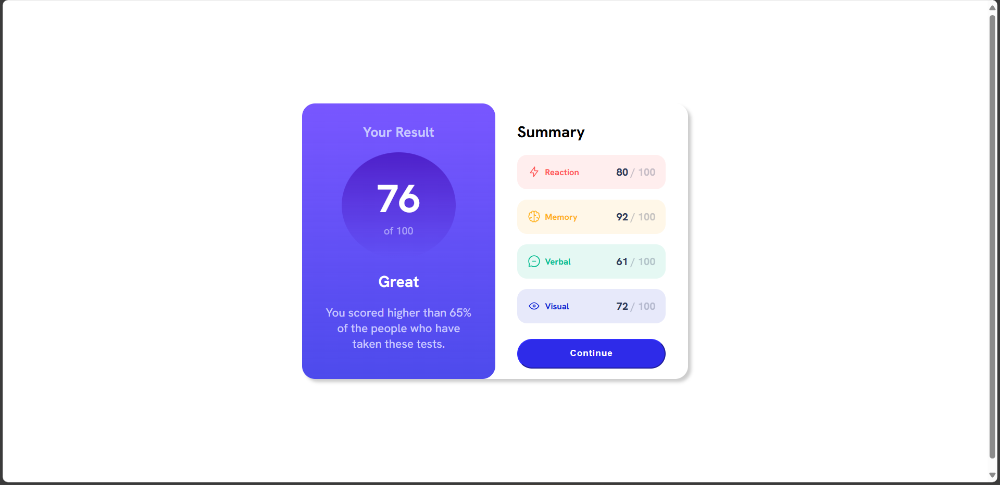
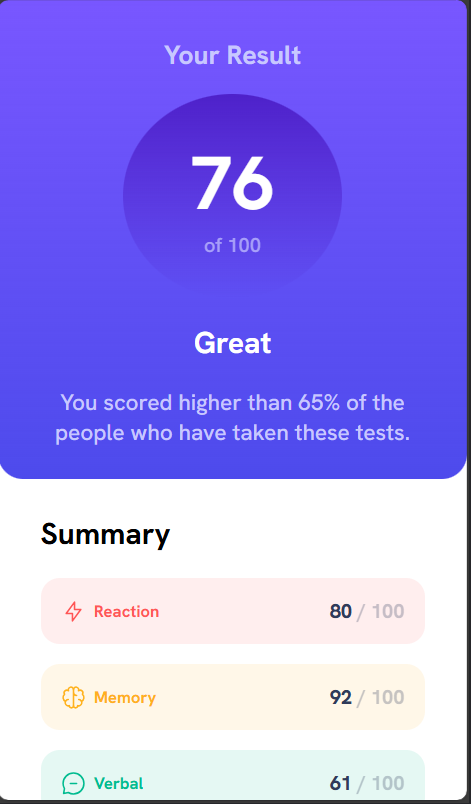

# Frontend Mentor - Results summary component solution

This is a solution to the [Results summary component challenge on Frontend Mentor](https://www.frontendmentor.io/challenges/results-summary-component-CE_K6s0maV). Frontend Mentor challenges help you improve your coding skills by building realistic projects. 

## Table of contents

- [Overview](#overview)
  - [The challenge](#the-challenge)
  - [Screenshot](#screenshot)
  - [Links](#links)
- [My process](#my-process)
  - [Built with](#built-with)
  - [What I learned](#what-i-learned)
  - [Continued development](#continued-development)
  - [Useful resources](#useful-resources)
- [Author](#author)


## Overview

### The challenge

Users should be able to:

- View the optimal layout for the interface depending on their device's screen size
- See hover and focus states for all interactive elements on the page

### Screenshot





### Links

- Solution URL: 
- Live Site URL: 

## My process

### Built with

- Mobile-First Workflow
- Media Queries 
- Semantic HTML Elements 
- CSS Pseudo-classes
- CSS Flex

### What I learned

I learned how to use `:is()` in CSS to style elements on my webpage. See my code below: 

```css
.category :is(img) { width: 20px; height: 20px; }
.category :is(h5) { margin: 0.125em auto 0.125em 0.5em; }
.category :is(p) { color: var(--clr-n__gray); }

.category :is(p)::after {
    content: " / 100";
    opacity: 0.275; 
}
```
This will be highly useful as learning the different CSS selectors and psuedo-classes will help me make more robust and maintainable CSS code. Another thing that was useful was the implementation of the media query to make the webpage dynamic for different viewport sizes. See code below: 

```css 
@media screen and (min-width: 426px)  {

    main {
        min-height: 100vh; 
        display: flex; 
        justify-content: center; 
        align-items: center; 
    }
    
    .results {
        display: flex; 
        flex-direction: row; 
        justify-content: center; 
        background-color: white; 
        border-radius: 20px; 
        box-shadow: 5px 5px 5px #ccc; 
    }

    :is(.results__card, .results__scores) {
        max-width: 35ch; 
        width: 50%;  
        border-radius: 20px; 
    }

}
```
### Continued development

I do want to continue learning the CSS psuedo-classes to help me get better with styling elements. Additionally, I do want to continue learning about media queries to get better at when to use them. Also I do want to start getting comfortable with using JavaScript to achieve function and help make my webpages even more dynamic. 

### Useful resources

- [MDN Web Docs](https://developer.mozilla.org/en-US/docs/Web)


## Author

- Frontend Mentor - [@LeviKuhaulua](https://www.frontendmentor.io/profile/LeviKuhaulua)
- Github - [LeviKuhaulua](https://github.com/LeviKuhaulua)
- LinkedIn - [Levi Kuhaulua](www.linkedin.com/in/levi-kuhaulua)


