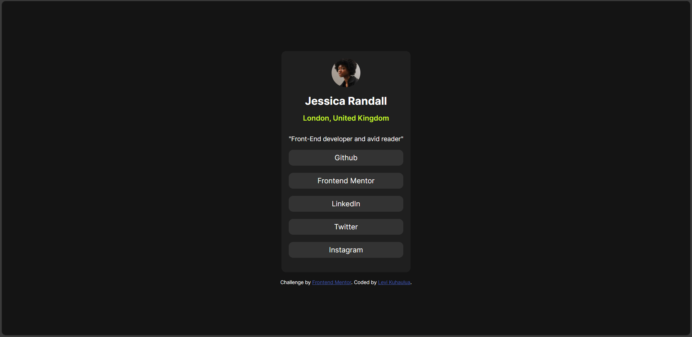
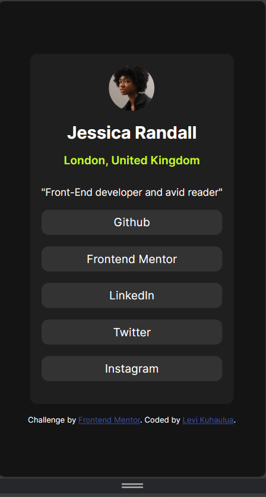
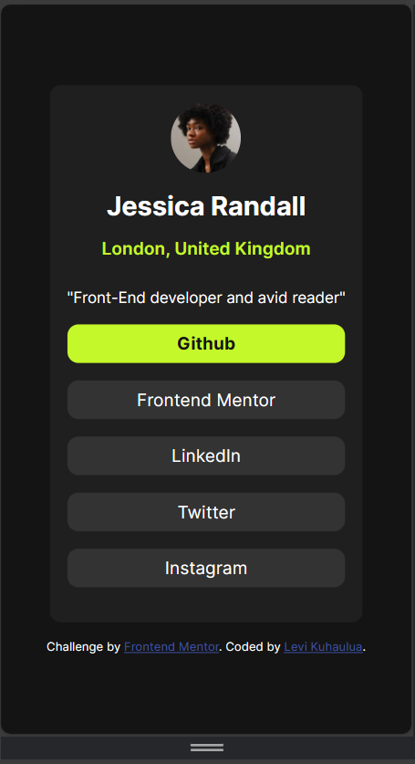

# Frontend Mentor - Social links profile solution

This is a solution to the [Social links profile challenge on Frontend Mentor](https://www.frontendmentor.io/challenges/social-links-profile-UG32l9m6dQ). Frontend Mentor challenges help you improve your coding skills by building realistic projects. 

## Table of contents

- [Overview](#overview)
  - [The challenge](#the-challenge)
  - [Screenshot](#screenshot)
  - [Links](#links)
- [My process](#my-process)
  - [Built with](#built-with)
  - [What I learned](#what-i-learned)
  - [Continued development](#continued-development)
  - [Useful resources](#useful-resources)
- [Author](#author)
- [Acknowledgments](#acknowledgments)

**Note: Delete this note and update the table of contents based on what sections you keep.**

## Overview

### The challenge

Users should be able to:

- See hover and focus states for all interactive elements on the page

### Screenshot

 
 


### Links

- Solution URL: 
- Live Site URL: 

## My process

### Built with

- Desktop-First Approach 
- HTML Semantic Elements 
- CSS Grid
- CSS classes & pseudo-classes

### What I learned

Something that I learned was the `min` function in CSS that I used to help make the card responsive to smaller screensizes. See code below: 

```css
.card {
  ... code before hand 
  
  max-width: min(30ch, 80% + 1em); /* width will be the minimum of the two */ 
  
  ... code after
}
```

### Continued development

I want to continue using the `min` function and other functions in CSS such as `max` to help make elements more responsive without needing to use something such as a media query.

### Useful resources

- [MDN Web Docs - min() function](https://developer.mozilla.org/en-US/docs/Web/CSS/min) - documentation regarding the min function and how it works. 

## Author

- Frontend Mentor - [@LeviKuhaulua](https://www.frontendmentor.io/profile/LeviKuhaulua)
- Github - [LeviKuhaulua](https://github.com/LeviKuhaulua)
- LinkedIn - [Levi Kuhaulua](www.linkedin.com/in/levi-kuhaulua)


